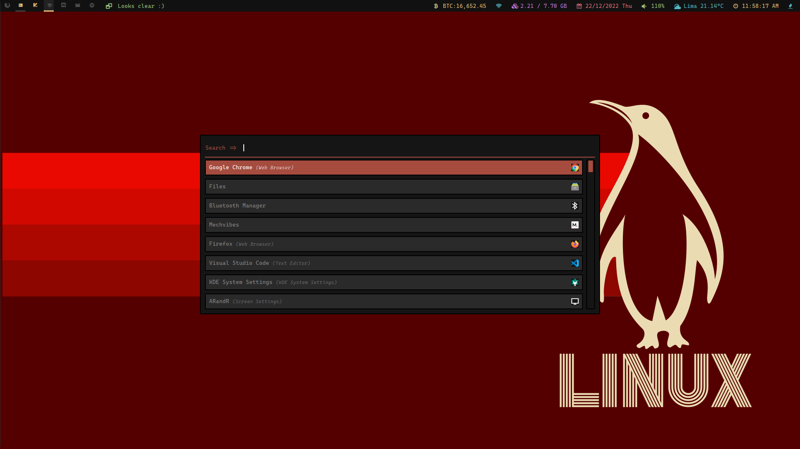

# Erebus theme

This is red dark theme, that gives you magic powers at coding. Try it and grow. You're welcome to contribute, also you can change the red color for another one, it's fully customizable.

## Set up
For install this theme and anothers you must create an folder at `~/.config/rofi`, so in that folder `rofi/` you'll put all themes that you want, in this case the `.rasi` file located at `theme/erebus.rasi`. After that you're ready to create `config.rasi` file at `~/.config/rofi`, this it's an "__leader__" file and inside just put `@theme "erebus"`, and that's all.

## By command line
If you like, could do all of the above by one command line, linux cheers.
`mkdir ~/.config/rofi && touch ~/.config/rofi/config.rofi; echo '@theme "erebus"' >> ~/.config/rofi/config.rasi; git clone https://github.com/kadaxi/rofi-erebus-theme.git; mv rofi-erebus-theme/theme/erebus.rasi ~/.config/rofi/`.
